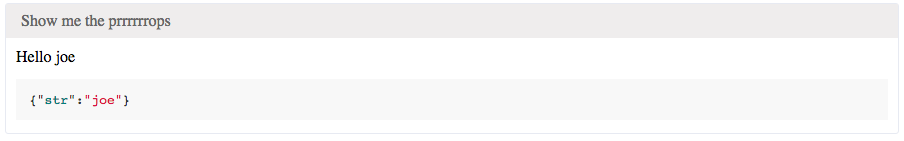

Devcards.js
================

This project aims at doing the same as did Dan Abramov, bring back
some of the good tricks from more functional language to Js.

See https://github.com/bhauman/devcards
Then try to come back to the old world of js-land.

This time I aims at Devcards.
They are quite simple at the essence.
Just some simple React components with some nice features attached to them.

Should definitively read this: http://rigsomelight.com/devcards/#!/devdemos.core
And watch this: https://vimeo.com/97078905

I won't give more explanantion, Bruce Hauman did an excelent job on the subject on interactive programming.
Plus I don't intend to create features that don't exists in clojurescript's devcards.

Particular points
==================

* don't provide hot reload. But webpack does it quite nicely with HMR.

How to setup up ?
=====================

+ integrate `devcards.js` into your build pipline.
+ Create a module which will hold your devcards.
+ import the `devcard` and `startRenderLoop` from the devcard module like this

````js
import {devCard, startRenderLoop} from 'devcard';
````

+ Use the devCard function as show in the example section
+ Start explicitly the ui from you html file in a js script tag (like below)
+ If you feels fancy, you could also add a css file from highligh.js. I've included the github.css,
because it's ok with me.


```js
startRenderLoop();
```

Exemples
=========

Simplest card
-------------

```jsx
//Let's say I've got a component this that
//This component wil just make a string "who $this.props.who"
<MyComponent who="Joe"/>

//And That I want to try it like this
devCard(
  "A not so fancy card", 
  MyComponent);
});

```

Here is the result:


A documenting card
------------------

```jsx

devCard(
  'A card with markdown',
  MyComponent,
  {str:"Joe"},
  `## Important Stuff
  ### Really important stuff
  Es6 doesn\'t get proper support for multi line string
  What a shame for cards like this one
  
  Here is some *weird* String! Don\'t You thinK Paulie?`,  
);
```

Here is the result:


A debugging card
----------------

```jsx
const props = {str: 'joe'}
devCard(
  "Show me the prrrrrrops", 
  MyComponent, 
  props);
```
Here is the result:


