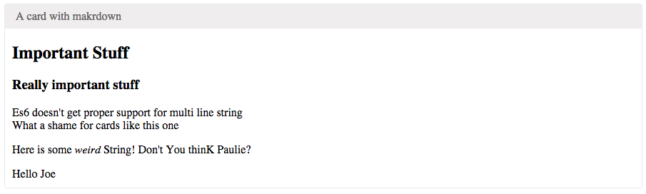

Devcards.js
================

See https://github.com/bhauman/devcards
Then try to come back to the old world of js-land.

This project aims at doing the same as did Dan Abramov, bring back
some of the good tricks from more functional language to Js.

This time I aims at Devcards.
They are quite simple at the essence.
Just some simple React components with some nice features attached to them.

Should definitively read this: http://rigsomelight.com/devcards/#!/devdemos.core
And watch this: https://vimeo.com/97078905

I wont give more explanantion, Bruce Hauman did a great job at this.
Plus I don't intend to create features that don't exists in clojurescript's devcards.

Exemples
=========

Simplest card
-------------

```jsx
//Let's say I've got a component this that
//This component wil just make a string "who $this.props.who"
<MyComponent who="Joe"/>

//And That I want to try it like this
<DevCard title="A not so fancy card">
  <MyComponent />
</DevCard>
});

```

Here is the result:


A documenting card
------------------

```jsx

const doc = "## Important Stuff \n\
### Really important stuff\n\
Es6 doesn\'t get proper support for multi line string  \n\
What a shame for cards like this one\n\
\n\
\n\
Here is some *weird* String! Don\'t You thinK Paulie?\
"
<DevCard doc={doc}
         title="A card with makrdown">
  <MyComponent str="Joe"/>
</DevCard>

```

Here is the result:


